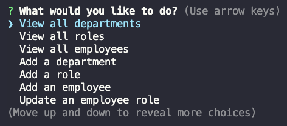
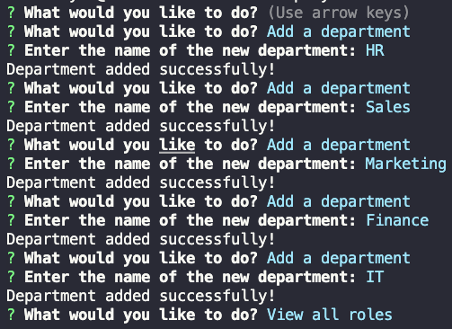
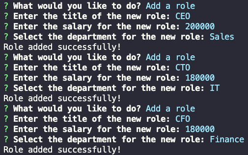
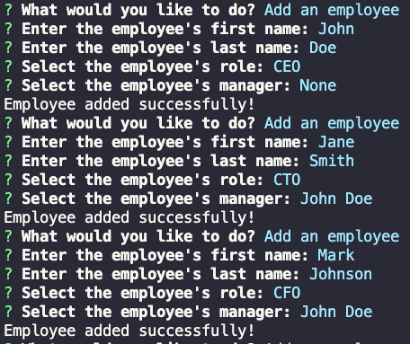
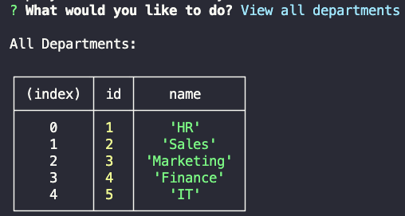
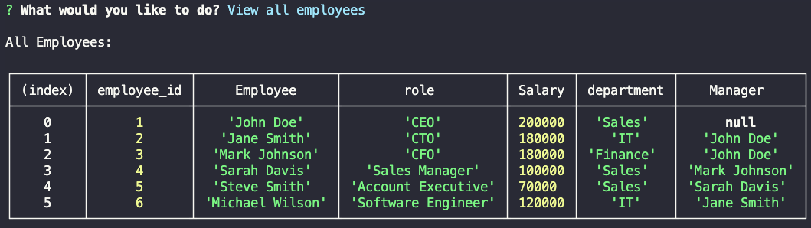
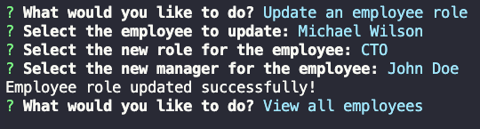
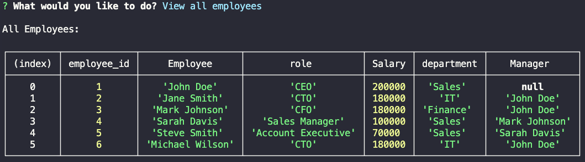

  

# Employee Tracker

  
  
  ## Table of Contents

  

  
  
  
  
  
  
  

## Description
A command line application that allows employers to track their employees.  This application was created as a part of the UC-Irvine coding bootcamp. The following user story and acceptance criteria were provided:

### User Story

AS A business owner  
I WANT to be able to view and manage the departments, roles, and employees in my company  
SO THAT I can organize and plan my business  

### Acceptance Criteria

GIVEN a command-line application that accepts user input  
WHEN I start the application  
THEN I am presented with the following options: view all departments, view all roles, view all employees, add a department, add a role, add an employee, and update an employee role  
WHEN I choose to view all departments  
THEN I am presented with a formatted table showing department names and department ids  
WHEN I choose to view all roles  
THEN I am presented with the job title, role id, the department that role belongs to, and the salary for that role  
WHEN I choose to view all employees  
THEN I am presented with a formatted table showing employee data, including employee ids, first names, last names, job titles, departments, salaries, and managers that the employees report to  
WHEN I choose to add a department  
THEN I am prompted to enter the name of the department and that department is added to the database  
WHEN I choose to add a role  
THEN I am prompted to enter the name, salary, and department for the role and that role is added to the database  
WHEN I choose to add an employee  
THEN I am prompted to enter the employee’s first name, last name, role, and manager, and that employee is added to the database  
WHEN I choose to update an employee role  
THEN I am prompted to select an employee to update and their new role and this information is updated in the database

(<a href="#back_to_top">back to top</a>)

## Installation
<ul>
<li>
Download the repo from the [github repo](https://github.com/ultimated1228/employeeTracker).
</li><li>
Open up the db folder in a command line terminal. 
</li><li>
Run "mysql -uroot" add -p if you your mysql is password protected. 
</li><li>
Use the command "SOURCE schema.sql" to create the employee_dir database. 
</li><li>
Exit mysql. 
</li><li>
Open the main folder in a command line terminal. 
</li><li>
Run "npm i" to install the dependencies from the package.json file. 
</li><li>
Now run "node index".  This will begin the command line prompts where you can choose to add departments, roles, and employees.  
</li><li>
PLEASE NOTE: you must add in order.  Without a department, you cannot add role.  And without a department and role you cannot add employees. 
</li><li>
From there you can view the tables as you would like to see the data you have entered by choosing one of the first 3 prompts.  
</li><li>
To exit the node application press "cntl+c". 
</ul>

(<a href="#back_to_top">back to top</a>)

## Usage
Here are examples of the app in use:

### Images

 

Above is an example of the prompts that load when the application first starts.
  
 
 Above is an example of the add department functionality.
  
 
Above is an example of the add role functionality.
  
 
Above is an example of the add Employee functionality.
  
 
Above is an example of the view departments functionality.
  
 
Above is an example of the view employees functionality.
  
 
Above is an example of the update employee functionality.
  
 
Above is an example of the updated employee table (notice that Michael Wilson is now CTO, has a much nicer salary, and is managed by John Doe).

### Video Walkthrough

[Please click here to see a full video walk through with audio](https://drive.google.com/file/d/1YKCPpLwb83k-V6-a0jg26bQTQqUpUlRa/view?usp=sharing)
  

(<a href="#back_to_top">back to top</a>)

## Contributing
Everyone is welcome to send contirbutions up for review through github!  All contributions will certainly be reviewed and committed if found valuable!

(<a href="#back_to_top">back to top</a>)

## Tests
No tests developed for this app.

(<a href="#back_to_top">back to top</a>)

## License
MIT License

Copyright (c) 2023 ultimated1228

Boost Software License - Version 1.0 - August 17th, 2003

Permission is hereby granted, free of charge, to any person or organization
obtaining a copy of the software and accompanying documentation covered by
this license (the "Software") to use, reproduce, display, distribute,
execute, and transmit the Software, and to prepare derivative works of the
Software, and to permit third-parties to whom the Software is furnished to
do so, all subject to the following:

The copyright notices in the Software and this entire statement, including
the above license grant, this restriction and the following disclaimer,
must be included in all copies of the Software, in whole or in part, and
all derivative works of the Software, unless such copies or derivative
works are solely in the form of machine-executable object code generated by
a source language processor.

THE SOFTWARE IS PROVIDED "AS IS", WITHOUT WARRANTY OF ANY KIND, EXPRESS OR
IMPLIED, INCLUDING BUT NOT LIMITED TO THE WARRANTIES OF MERCHANTABILITY,
FITNESS FOR A PARTICULAR PURPOSE, TITLE AND NON-INFRINGEMENT. IN NO EVENT
SHALL THE COPYRIGHT HOLDERS OR ANYONE DISTRIBUTING THE SOFTWARE BE LIABLE
FOR ANY DAMAGES OR OTHER LIABILITY, WHETHER IN CONTRACT, TORT OR OTHERWISE,
ARISING FROM, OUT OF OR IN CONNECTION WITH THE SOFTWARE OR THE USE OR OTHER
DEALINGS IN THE SOFTWARE.

Fore more details on the [MIT License](https://opensource.org/licenses/MIT) please click the link!

(<a href="#back_to_top">back to top</a>)

## Contact
You can get in touch with the creator through:

[My Github](https://github.com/ultimated1228)

[Email the creator](mailto:stevenlucasmeyer@gmail.com)

(<a href="#back_to_top">back to top</a>)
